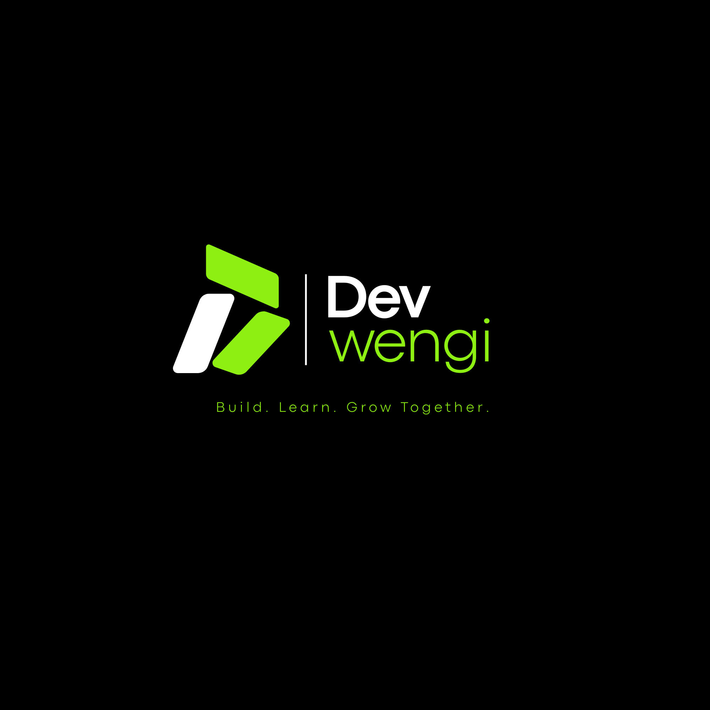

# Dev-Wengi

  
  

**Learn to code by building real projects, with real people.**

**dev.wengi** is a developer-focused community designed to inspire, support, and empower individuals at every stage of their tech journey.
The community simplifies the process of learning and breaking into tech by providing curated resources, practical guidance, and opportunities to work on real-world problems.
More than just a learning space, **dev.wengi** fosters collaboration and connection, bringing together individuals who are eager to build, explore, and grow together in a supportive and engaging environment.

No tutorials. No fluff. Just hands-on experience.

---

  
  
  
  

---

## Start Here

### 1. Pick a Track

Choose your battleground, for example if you're learning:

* Frontend → go to the folder `/tracks/frontend`

---

### 2. Start at Level 0

Every track is structured into levels.

* Begin at **Level 0**
* Follow the tasks step by step
* Resist the urge to skip ahead (future you will regret it)

---

### 3. Complete Tasks

Each level gives you:

* Clear goals
* Real-world tasks
* Starter code (when needed)

Your mission: **figure it out, break things, fix them, ship it**

---

### 4. Level Up

When you're done:

* Submit your work (PR)
* Get feedback
* Unlock the next level

Progress isn't given — it's earned.

---

### 5. Build Real Stuff

Time to leave the sandbox:

* Go to `/projects` and pick one, go through the README and understand what it needs
* Or simply pick an issue from the `issues` tab for this repo
* Contribute like it matters (because it does)
* You can also contribute to the dev.wengi community website []

---

## Choose Your Path

**🟢 Beginner**

Start with a track → follow levels → build confidence

**🟡 Intermediate**

Balance learning with real project contributions

**🔴 Advanced**

Skip the warm-up → dive into projects → solve real problems

---

## Community

You're building, not struggling in silence.

* Ask questions in Discussions, whatsApp & on [Discord](https://discord.com)
* Help others when you can
* Share what you learn

(Teaching is just debugging someone else's confusion.)

---

## Why Dev-Wengi?

* Learn by **doing**, not watching
* Work on **real codebases**, not toy projects
* Grow through **structured chaos** (guided, not hand-held)

---

## One Rule

> Don't just read. Build something. Break it. Fix it. Repeat.
