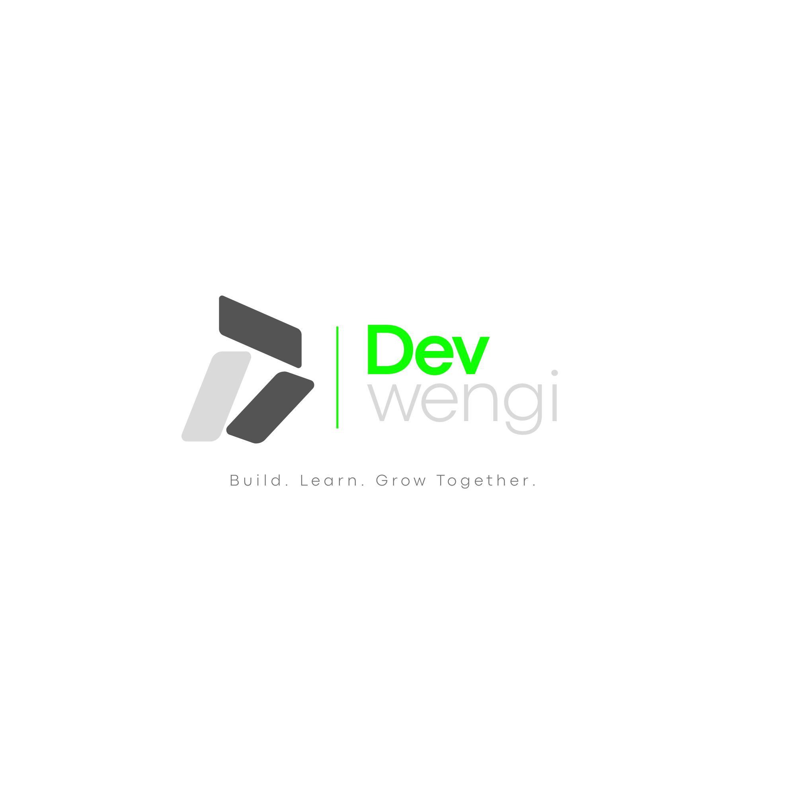

# Dev-Wengi Community Website

<div align="center">



**Build together. Learn together. Grow together.**

</div>

---

## What is this?

The **Dev-Wengi** Community Website is a simple hub for the Dev-Wengi community.

It exists to:

- Introduce what **Dev-Wengi** is about
- Guide new members on how to get started
- Point you to projects, resources, and the community

---

## What You Can Do Here

### Explore Projects

Discover real projects built by the community:

* Join ongoing builds
* Contribute to open issues
* Collaborate with other developers

---

### Connect With Developers

You're not learning alone:

* Meet people on the same journey
* Find collaborators
* Build your network organically

---

### Learn by Doing

No passive learning here:

* Solve real problems
* Contribute to real codebases
* Gain practical experience that actually matters

---

### Share Your Work

Built something?

* Showcase your projects
* Get feedback
* Inspire others

---

## How to Get Started

### 1. Join the Community

Jump into conversations, introduce yourself, and start engaging [here](https://discord.com).

---

### 2. Pick Something to Work On

* Browse available projects
* Or create your own

---

### 3. Contribute

* Submit improvements
* Fix bugs
* Build features

---

### 4. Grow Publicly

* Share progress
* Document your journey
* Help others along the way

---

## Who This Is For

**🟢 Beginners**
Start small. Learn fast. Build confidence.

**🟡 Intermediate Developers**
Sharpen your skills through collaboration and real projects.

**🔴 Advanced Developers**
Lead projects. Mentor others. Solve meaningful problems.

---

## Contributing to the Website

This website is built by the community, for the community. Your contributions are welcome. Check out our [figma designs](https://www.figma.com/design/Alo0GDpV67rTRzFc8s79B7/dev.wengi?node-id=0-1&t=ZDaJPtgxZeQMyu9K-1) to see what you can help implement.

### Ways to Contribute:

* Improve UI/UX
* Fix bugs
* Add features
* Optimize performance
* Suggest ideas

---

### Setup Instructions

```bash
# Clone the repository
git clone https://github.com/kc-clintone/dev-wengi.git

# Navigate into the project
cd dev-wengi/community-website

# Install dependencies
npm install

# Start development server
npm run dev
```

---

## Community Philosophy

> No tutorials. No fluff. Just building.

We believe:

* You learn best by **doing**
* Growth comes from **struggle + iteration**
* Collaboration beats isolation

---

## Core Rule

> Build something. Break it. Fix it. Repeat.

---

## Join the Movement

Dev-Wengi isn’t just a platform.

It’s a mindset.

A place where builders are made.
